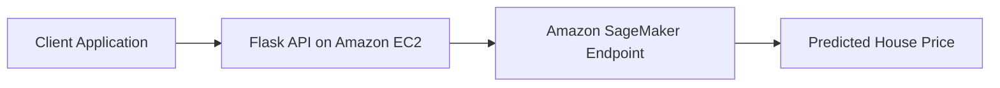

# House Price Prediction Using Amazon SageMaker

## Project Overview

This project develops a machine learning model for predicting residential property sale prices using selected housing characteristics from the Ames Housing dataset.

The model was initially developed and evaluated in Google Colab. The workflow was subsequently migrated to AWS to demonstrate cloud-based machine learning development. Amazon S3 is used to store the training dataset and model artifacts, while Amazon SageMaker provides a managed environment for executing the machine learning workflow.

The project covers data preparation, feature selection, model training, model evaluation, model serialization, and cloud storage of trained model artifacts. Deployment through a SageMaker real-time endpoint and integration with a Flask API are planned as future improvements.

## Problem Statement

Estimating the sale price of a residential property is challenging because property values are influenced by multiple characteristics, including construction quality, living area, garage capacity, basement size, number of bathrooms, and year of construction.

This project applies a Linear Regression model to learn the relationship between selected property characteristics and house sale prices. The trained model can be used to estimate the sale price of a property based on the selected input features.

## Project Objective

The objective of this project is to develop a regression model that predicts the following target variable:

```text
SalePrice
```

The model uses the following input features:

| Feature       | Description                                         |
| ------------- | --------------------------------------------------- |
| `OverallQual` | Overall material and finish quality of the property |
| `GrLivArea`   | Above-ground living area in square feet             |
| `GarageCars`  | Garage capacity measured by the number of cars      |
| `TotalBsmtSF` | Total basement area in square feet                  |
| `FullBath`    | Number of full bathrooms                            |
| `YearBuilt`   | Original year of construction                       |

The prediction workflow is represented as follows:

```text
Property Features
        |
        v
Linear Regression Model
        |
        v
Predicted Sale Price
```

## System Architecture

```mermaid
flowchart LR
    A[House Price Dataset] --> B[Amazon S3]

    B --> C[Amazon SageMaker Notebook Instance]

    C --> D[Data Preparation]

    D --> E[Feature Selection]

    E --> F[Train-Test Split]

    F --> G[StandardScaler]

    G --> H[Linear Regression Model]

    H --> I[Model Evaluation]

    I --> J[Joblib Model Artifacts]

    J --> K[Amazon S3 Model Storage]

    K -. Planned .-> L[SageMaker Real-Time Endpoint]

    L -. Planned .-> M[Flask API on Amazon EC2]

    M -. Planned .-> N[Real-Time House Price Prediction]
```



### Architecture Description

The dataset is stored in Amazon S3 and accessed through an Amazon SageMaker Notebook Instance. The dataset is prepared and divided into training and testing sets. The selected numerical features are standardized using `StandardScaler`, after which a Linear Regression model is trained and evaluated.

The trained model and feature information are serialized using Joblib and stored in Amazon S3. Future development will include deployment through a SageMaker real-time endpoint and integration with a Flask API hosted on Amazon EC2.

## AWS Architecture Flow

```text
+--------------------------+
| Ames Housing Dataset     |
| train.csv                |
+------------+-------------+
             |
             v
+--------------------------+
| Amazon S3                |
| team-iota-mlops          |
+------------+-------------+
             |
             v
+--------------------------+
| Amazon SageMaker         |
| Notebook Instance        |
|                          |
| team-iota-mlops-notebook |
+------------+-------------+
             |
             v
+--------------------------+
| Data Preparation         |
| Feature Selection        |
| Train-Test Split         |
| Feature Scaling          |
+------------+-------------+
             |
             v
+--------------------------+
| Linear Regression        |
| Model Training           |
+------------+-------------+
             |
             v
+--------------------------+
| Model Evaluation         |
| RMSE, MAE, and R-squared |
+------------+-------------+
             |
             v
+--------------------------+
| Joblib Model Artifacts   |
| Stored in Amazon S3      |
+------------+-------------+
             |
             v
+--------------------------+
| Planned                  |
| SageMaker Endpoint       |
+------------+-------------+
             |
             v
+--------------------------+
| Planned                  |
| Flask API on Amazon EC2  |
+--------------------------+
```

## Technologies

### Programming and Machine Learning

* Python
* Pandas
* NumPy
* Matplotlib
* Seaborn
* Scikit-learn
* Joblib

### AWS Services

* Amazon S3
* Amazon SageMaker AI
* AWS Identity and Access Management

### Development Environments

* Google Colab
* Amazon SageMaker Notebook Instance
* Jupyter Notebook

## Project Structure

```text
team-iota-mlops/
|
|-- Team_Success.ipynb
|
|-- README.md
|
|-- data/
|   |
|   |-- train.csv
|
|-- models/
    |
    |-- house_price_model.joblib
    |
    |-- features.joblib
```

## Amazon S3 Structure

```text
s3://team-iota-mlops/
|
|-- data/
|   |
|   |-- train.csv
|
|-- models/
    |
    |-- house_price_model.joblib
    |
    |-- features.joblib
```

## Dataset

The project uses the House Prices: Advanced Regression Techniques dataset from Kaggle.

The dataset contains information about residential properties in Ames, Iowa. The data includes property characteristics such as:

* Overall property quality
* Above-ground living area
* Garage capacity
* Total basement area
* Number of bathrooms
* Year of construction
* Sale price

Dataset source:

[House Prices: Advanced Regression Techniques on Kaggle](https://www.kaggle.com/competitions/house-prices-advanced-regression-techniques?utm_source=chatgpt.com)

The training dataset contains 1,460 property records and 81 columns. The `SalePrice` column is used as the target variable.

## Machine Learning Workflow

### Data Loading

The training dataset is loaded from Amazon S3 into the SageMaker notebook environment.

```python
import pandas as pd

bucket_name = "team-iota-mlops"

data_path = f"s3://{bucket_name}/data/train.csv"

df = pd.read_csv(data_path)

df.head()
```

### Feature Selection

The model uses six input features:

```python
features = [
    "OverallQual",
    "GrLivArea",
    "GarageCars",
    "TotalBsmtSF",
    "FullBath",
    "YearBuilt"
]

X = df[features]

y = df["SalePrice"]
```

### Train-Test Split

The dataset is divided into training and testing sets using an 80:20 ratio.

```python
from sklearn.model_selection import train_test_split

X_train, X_test, y_train, y_test = train_test_split(
    X,
    y,
    test_size=0.2,
    random_state=42
)
```

### Feature Scaling

The input features are standardized using `StandardScaler`.

```python
from sklearn.preprocessing import StandardScaler

scaler = StandardScaler()

X_train_scaled = scaler.fit_transform(X_train)

X_test_scaled = scaler.transform(X_test)
```

The scaler is fitted using only the training data and then applied to the testing data. This prevents information from the testing dataset from influencing the training process.

### Model Training

A Linear Regression model is trained using the standardized training data.

```python
from sklearn.linear_model import LinearRegression

model = LinearRegression()

model.fit(
    X_train_scaled,
    y_train
)
```

### Model Prediction

The trained model is used to generate predictions for the testing dataset.

```python
y_pred = model.predict(
    X_test_scaled
)
```

### Model Evaluation

The model is evaluated using Root Mean Squared Error, Mean Absolute Error, and the coefficient of determination.

| Evaluation Metric       |  Result |
| ----------------------- | ------: |
| Root Mean Squared Error | $39,711 |
| Mean Absolute Error     | $25,320 |
| R-squared Score         |  0.7944 |

### Performance Interpretation

The R-squared score of 0.7944 indicates that the model explains approximately 79.44 percent of the variation in house sale prices using the selected input features.

The Mean Absolute Error of $25,320 indicates that the model's predictions differ from the actual sale prices by approximately $25,320 on average.

The Root Mean Squared Error of $39,711 provides an additional measure of prediction error and assigns greater weight to larger prediction errors.

## Model Serialization

The trained Linear Regression model is saved using Joblib.

```python
import joblib

joblib.dump(
    model,
    "house_price_model.joblib"
)
```

The selected feature names and their expected order are saved separately.

```python
joblib.dump(
    list(X.columns),
    "features.joblib"
)
```

### Model Artifacts

| File                       | Description                                                  |
| -------------------------- | ------------------------------------------------------------ |
| `house_price_model.joblib` | Contains the trained Linear Regression model                 |
| `features.joblib`          | Contains the selected feature names and their expected order |

The model artifacts are stored in the following Amazon S3 location:

```text
s3://team-iota-mlops/models/
```

## AWS Configuration

| Resource                    | Configuration              |
| --------------------------- | -------------------------- |
| AWS Region                  | `eu-west-1`                |
| Region Location             | Ireland                    |
| Amazon S3 Bucket            | `team-iota-mlops`          |
| SageMaker Notebook Instance | `team-iota-mlops-notebook` |
| Machine Learning Algorithm  | Linear Regression          |

## Screenshots

### Amazon S3 Storage

```text
SCREENSHOT PLACEHOLDER

Insert a screenshot showing the following structure:

team-iota-mlops
|
|-- data
|   |
|   |-- train.csv
|
|-- models
    |
    |-- house_price_model.joblib
    |
    |-- features.joblib
```

### Amazon SageMaker Notebook Instance

```text
SCREENSHOT PLACEHOLDER

Insert a screenshot showing:

Notebook instance:
team-iota-mlops-notebook

Status:
InService
```

### Model Evaluation Results

```text
SCREENSHOT PLACEHOLDER

Insert a screenshot showing:

RMSE: $39,711

MAE: $25,320

R-squared: 0.7944
```

### SageMaker Endpoint

```text
FUTURE SCREENSHOT PLACEHOLDER

Insert a screenshot showing:

SageMaker endpoint status:
InService
```

## Future Improvements

### SageMaker Real-Time Endpoint

The trained model will be packaged in a SageMaker-compatible format and deployed as a real-time inference endpoint.

The endpoint will receive property characteristics and return a predicted sale price.

```text
New Property Features
        |
        v
SageMaker Endpoint
        |
        v
Linear Regression Model
        |
        v
Predicted Sale Price
```

### Flask Prediction API

A Flask REST API will be developed to provide an application interface for the model.

Proposed endpoint:

```text
POST /predict
```

Example request:

```json
{
  "OverallQual": 7,
  "GrLivArea": 1710,
  "GarageCars": 2,
  "TotalBsmtSF": 856,
  "FullBath": 2,
  "YearBuilt": 2003
}
```

Example response:

```json
{
  "predicted_sale_price": 215000
}
```

### Amazon EC2 Deployment

The Flask application may be hosted on an Amazon EC2 instance and integrated with the SageMaker endpoint.



### Model Improvement

Potential model improvements include:

* Evaluating additional regression algorithms
* Increasing the number of input features
* Applying feature engineering
* Performing hyperparameter optimization
* Using cross-validation
* Comparing Linear Regression with Random Forest and XGBoost
* Improving prediction performance

### MLOps Automation

Future MLOps improvements may include:

* Automated training pipelines
* Model versioning
* Automated deployment
* Model monitoring
* Data drift detection
* Model performance monitoring
* Continuous integration and continuous deployment

## Project Status

| Project Component                   | Status    |
| ----------------------------------- | --------- |
| Dataset acquisition                 | Completed |
| Data exploration                    | Completed |
| Feature selection                   | Completed |
| Data preprocessing                  | Completed |
| Linear Regression model training    | Completed |
| Model evaluation                    | Completed |
| Model serialization                 | Completed |
| Model artifact storage in Amazon S3 | Completed |
| SageMaker real-time endpoint        | Planned   |
| Endpoint prediction testing         | Planned   |
| Flask API development               | Planned   |
| Flask deployment on Amazon EC2      | Planned   |

## How to Run the Project

### Prerequisites

Install the required Python packages:

```bash
pip install pandas numpy seaborn matplotlib scikit-learn joblib boto3 s3fs
```

### Execution Steps

1. Open Amazon SageMaker AI in the AWS Management Console.

2. Open the notebook instance:

```text
team-iota-mlops-notebook
```

3. Launch JupyterLab.

4. Open the following notebook:

```text
Team_Success.ipynb
```

5. Select the following kernel:

```text
conda_python3
```

6. Run the notebook cells sequentially.

## Key Learning Outcomes

This project demonstrates the following technical skills:

* Developing a regression model using Scikit-learn
* Selecting relevant features for machine learning
* Splitting data into training and testing datasets
* Standardizing numerical features
* Evaluating regression models using RMSE, MAE, and R-squared
* Serializing machine learning models using Joblib
* Using Amazon S3 for dataset and model artifact storage
* Using Amazon SageMaker Notebook Instances for cloud-based machine learning development
* Preparing a machine learning model for future cloud deployment

## Team

Team Iota

Project: House Price Prediction Using Amazon SageMaker

AWS Region: Ireland (`eu-west-1`)

## License

This project is intended for educational and portfolio purposes.

## Acknowledgements

* Kaggle for providing the House Prices dataset
* AWS for providing Amazon S3 and Amazon SageMaker
* Scikit-learn for the machine learning tools used in this project
* Code Build PS for the cloud and machine learning learning experience
